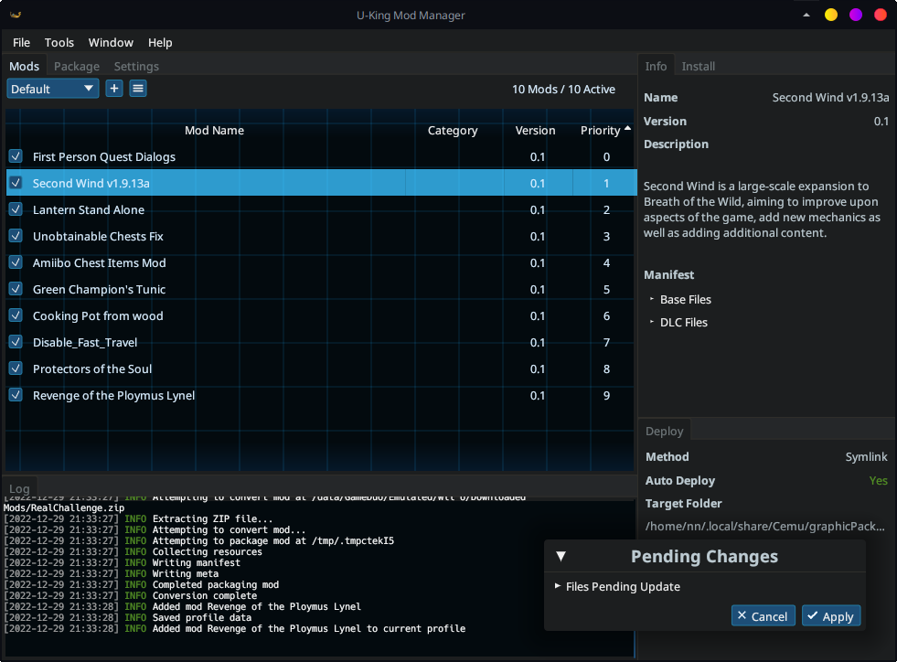

# Interface

 The main UKMM interface

## General Use

The UKMM interface is largely divided into docked, tabbed sections. These can be
moved and resized into whatever arrangement you like (and you can use the Reset
button under the Window menu if you end up not liking it). Let's cover a few of
the most important parts.

### Mods Tab

Most of your real business is done here. Along the top bar of the mods tab you
can switch, add, or manage mod profiles. 

Beneath is a table with all installed mods in the current profile. You can sort
it by name, category, version, etc. by clicking on the respective headers. Mods
can be enabled or disabled using the toggle boxes on their left.

Mods can be dragged and dropped to change their priority order. Hold Shift or
Control to select multiple mods. Right-clicking a mod exposes a few other
options.

No changes made on the mod list take effect until you apply them, which brings
us to…

### Pending Changes Window

Any and all changes made to your mod collection will be queued for application.
When changes are pending, the Pending Changes window will appear in the bottom
right of the screen. 

- If you click Cancel, all changes will be undone and your mod profile will
  revert to its last saved state. 
- If you click Apply, your new mod settings will be saved, and all game files
  affected by the accumulated changes will be preprocessed and merged. (Note:
  This can take some time if very large mods are involved.)

### Info Tab

This is Captain Obvious, here to inform you that the Info tab shows information
about the currently selected mod. There's not a great deal to say about this
except for two potentially noteworthy features:

- **Option Settings**: If you have a mod which includes configurable options,
  the Info tab will show which options are currently enabled. It will also have
  an icon button to change the enabled options. If you change options, those
  changes will be queued in the Pending Changes window per usual.
- **Manifest**: For reference and perhaps debugging, the Info tab will also show
  a manifest listing what files are edited by the current mod. Can potentially
  be useful if tracking down some unexpected mod behavior.

### Install Tab

For convenience, UKMM also includes a file browser tab for quick mod
installation. Use it if you want, or don't; it's up to you. 

## More

- Most of the Packaging tab is self-explanatory if you understand [packaging
  UKMM mods](./mod_format.md).
- Most of what you need to know about the Settings tab goes back to
  [Configuration](setup/configuration.md).
- The Deploy tab shows your current deployment settings. If you don't have
  automatic deployment turned on, you will need to click the Deploy button here
  to deploy your mods to their final destination.
- The Log tab is pretty much what it says on the tin. If you need to track down
  some error or problem, check here. If the default logging information isn't
  enough, you can enable verbose logging in the Help menu. If you don't care
  about performance and *really* need to dig deep, you can try setting the
  environment variable `RUST_LOG=trace`, but be warned, **this is extreme
  logging that will slow down most operations**.
